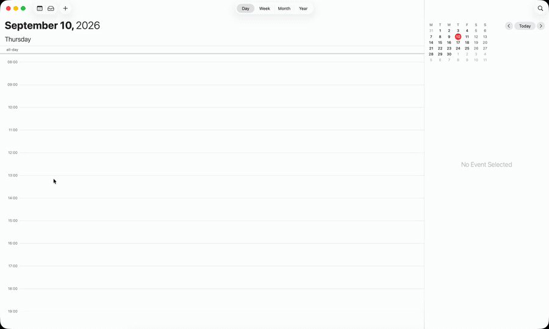
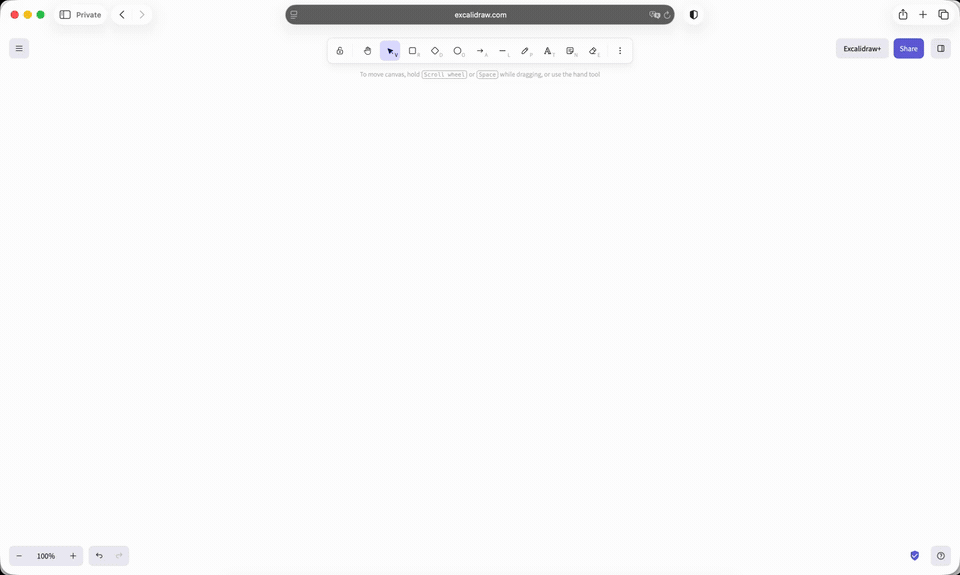

# sloth-mcp

**macbook clicking your stuff.**

I'm not writing a proper README. It's called sloth for a reason.

---

Fine, a bit more.

An MCP server that gives Claude Desktop eyes and hands on a Mac. No Accessibility
API, no browser driver, no app plugins — it looks at pixels and clicks like you do,
so it works with anything that draws on screen.

The point is not that a model can click. The point is **not paying for a screenshot
every time it does.**

## What it looks like



Five calendar entries, one call. Claude sent twenty-five steps — press `+`, type,
Enter, escape, again — and got back one text journey saying what happened at each
of them. Nothing was looked at in between. Real time, not sped up.
([full quality](media/calendar.mp4))

It has no idea what a calendar is. Here is the same server in a drawing app it has
never seen, picking tools out of a toolbar and dragging shapes:



([full quality](media/excalidraw.mp4)) — the caption drawn inside that clip
overstates it, so: the server looks at the screen constantly, it has to. What it
does not do is send those frames to the model. Thirteen actions, one screenshot's
worth of tokens, and that one only if something had gone wrong.

## How it goes

Claude sends a batch of semantic steps — `click "Save"`, `wait until "Export"
appears`, `read the table` — and the server executes the whole batch on its own:
finds targets by their visible text, waits for the interface to settle by watching
pixels instead of sleeping, and comes back only when the plan and reality disagree.
One escalation carries a screenshot, the journey so far and the screen markup, so
the next plan starts from the failure instead of from scratch.

It also remembers. Every window it reads becomes a node in a local SQLite graph:
what is in it, what clicking each thing led to, when it was last seen. Ask it what
it knows about an app and you get a text map with dates — and you can plan a whole
route from that map **without looking at the screen at all.**

## The numbers

- A screenshot costs **~1400 tokens**. The same window from the map costs **a few
  hundred** — 6 to 12 times cheaper, and that is the difference between one look
  per step and one look per plan.
- A familiar window is recognised by a perceptual hash of its content, so OCR is
  skipped entirely. On a live run walking System Settings, **16 of 20 reads came
  from memory** — recognition ran 4 times instead of 20.
- Semantic target matching runs as one batch instead of one call per line: on a
  1200-line screen that is **1 model call instead of 828**, ~11x faster.
- Waiting is measured, not guessed. A macOS pane transition is two repaints with a
  dead-still gap of 115–565 ms between them, so "the screen went quiet" is not the
  same as "the transition finished" — the server tells them apart by *where* the
  pixels moved, not by how long they stayed still.

## Running it

```bash
uv sync
uv run choto service install
uv run choto service status
```

The commands are called `choto` — that was the project's name before it was a sloth,
and renaming every entry point is a change for its own sake. Same thing.

**Optional:** an icon detector. Without one the server reads everything by its
visible text, which is most of a Mac; with one it also finds the controls that are
only a glyph — the back arrow, the toolbar buttons, the switches with no label. If
you have a CoreML `icon_detect.mlpackage`, point the server at it:

```bash
uv run choto model install --icon-detector /path/to/icon_detect.mlpackage
```

Then point Claude Desktop at the bridge:

```json
"sloth": {
  "command": "/opt/homebrew/bin/uv",
  "args": ["run", "--project", "/path/to/sloth-mcp", "choto-bridge"]
}
```

The bridge is a thin stdio↔socket shim on purpose: Claude Desktop hands its own TCC
identity to child processes, and that identity cannot be granted Accessibility — so
the process that actually moves the mouse has to be somebody else. macOS will ask
for **Screen Recording** and **Accessibility** for the signed `Choto.app` bundle
that `service install` puts in place.

Kill switch: throw the mouse into the top-left corner, or hit Stop in the overlay
frame.

## What it deliberately does not do

Accessibility API (universality beats convenience), Windows and Linux, multiple
displays, autonomous LLM calls from the server, and — for now — a README longer
than this one.

## License

MIT — see [LICENSE](LICENSE).

One thing that is not: the icon detector. `icon_detect.mlpackage` is not shipped
here and is not downloaded by anything in this repo — you point `model install` at
your own copy. The YOLO-derived weights that name refers to are **AGPL-3.0**, so
whatever you feed it comes with its own terms attached.

## Support

There isn't any. Issues are welcome and may sit unread — this is something I built
for my own machine and put out because it works, not a product with a roadmap.
Forks are the faster path to whatever you need.
